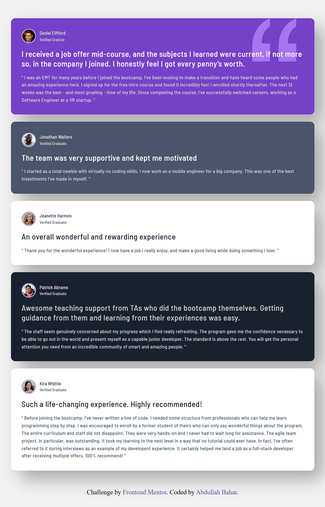

# Frontend Mentor - Testimonials grid section solution

Bu proje, [Frontend Mentor](https://www.frontendmentor.io/challenges/testimonials-grid-section-Nnw6J7Un7) üzerindeki **Testimonials Grid Section** challenge'nin çözümüdür. 

## İçindekiler

- [Genel Bakış](#overview)
  - [Challange](#challenge)
  - [Ekran Görüntüleri](#ekran-görüntüleri)
  - [Linkler](#linkler)
- [Süreç](#süreç)
  - [Kullanılan Teknolojiler](#kullanılan-teknolojiler)
  - [Faydalı Kaynaklar](#faydalı-kaynaklar)
- [Yazar](#yazar)

## Genel Bakış

### Challenge

Kullanıcıların yapması gerekenler:

- Cihaz boyutuna göre en uygun düzeni görebilmek

### Ekran Görüntüleri

<table>
	<tr>
  		<td align="center"><strong>Boyut 1440px</strong></td>
	</tr>
  	<tr>
  	  	<td align="center" style="border: none;">
  	    	
  	  	</td>
  	</tr>
</table>

<table>
  	<tr>
  		<td align="center"><strong>Boyut 992px</strong></td>
  		<td align="center"><strong>Boyut 768px</strong></td>
	</tr>
  	<tr>
  	  	<td align="center" valign="top">
  	   		
  	  	</td>
  	  	<td align="center" valign="top">
  	    	
  	  	</td>
  	</tr>
</table>

### Linkler

- Çözüm URL: [Github Repo](https://github.com/Abdullah-Bahar/Testimonials-Grid-Section)
- Canlı Site URL: [Github Pages](https://abdullah-bahar.github.io/Testimonials-Grid-Section/)

## Süreç

### Kullanılan Teknolojiler

- Anlamlı ve düzenli HTML5 yapısı
- Modern CSS ile tasarım 
- Flexbox - Kart başlıkları için
- CSS Grid - Ana layout `grid-template-areas` ile kuruldu
- desktop-first Yaklaşımı
- Responsive Tasarım 

### Faydalı Kaynaklar

- [GitHub - Web Geliştirme](https://github.com/Abdullah-Bahar/Web-Gelistirme) - Bu repoda yapmış olduğum çalışmalrım neticesinde edindiğim notlar içerisinde özellikle **grid kullanımına yönelik** olanları inceleyerek bu projeyi geliştirdim.

## Yazar

- GitHub - [Abdullah-Bahar](https://github.com/Abdullah-Bahar)
- Frontend Mentor - [@Abdullah-Bahar](https://www.frontendmentor.io/profile/Abdullah-Bahar)
- LinkedIn - [@bahar-abdullah](https://www.linkedin.com/in/bahar-abdullah/)
